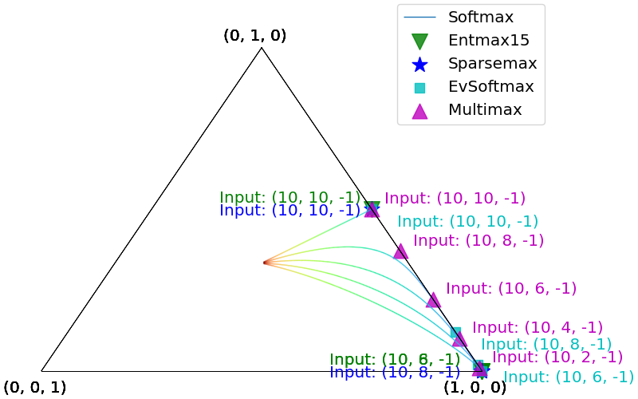
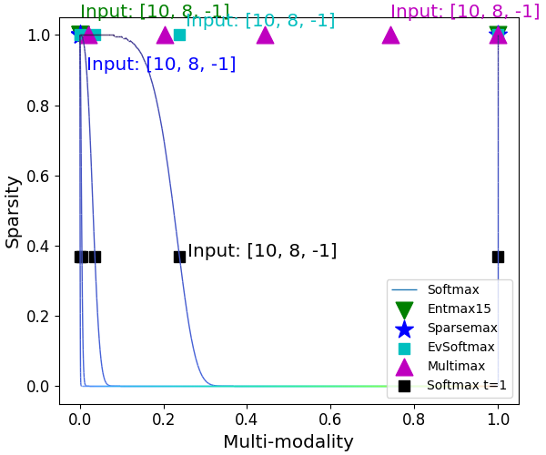
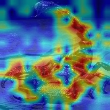
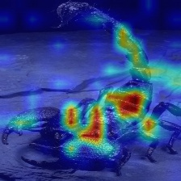

# MultiMax
[](https://proceedings.mlr.press/v235/zhou24g.html)

This is the official implementation of our ICML 2024 paper "MultiMax: Sparse and Multi-Modal Attention Learning".

## Improved multi-modality and sparsity
<p align="center">
   
   
</p>
<p align="left">
   <b>Figure 1:</b> We evaluate SoftMax, SparseMax, EntMax, EvSoftMax and MultiMax (using the parameters of a hidden layer MultiMax trained on ImageNet directly) functions on a series of example input points $v ∈ R^3$ and project the resulting distribution on a simplex $∆^2$. Informally, the interior of the simplex stands for trimodal distributions, the edges constitute the set of bimodal distributions, and the vertices are unimodal distributions. Notably, the above figures highlight the advantage of MultiMax’s multi-modality. EntMax, Sparsemax and SoftMax with small temperature (blue colored line) yield a (quasi) uni-modal distribution, which ignore the second largest entry. In contrary, SoftMax with higher temperatures (green and orange colored line) fails to ignore the negative entry.
</p>

<p align="center">
   
   
   
   
</p>
<p align="left">
   <b>Figure 2:</b> Grad-CAM of Deit-small using SoftMax (the two images on the left) and MultiMax (the two images on the right). 
    The MultiMax attention maps are better localized on the objects and are close to zero in most background regions, indicating sparsity at the attention level.
</p>

## MultiMax is **as efficient as** SoftMax

As shown in Equation 4, the total amount of additional parameters for a 12 layer Transformer with 2nd-order MultiMax is just 8x12=96, because each order only contains 4 parameters, including t_b, t_d, b and d. Moreover, the modulation function σ(x) merely consists of cheap element-wise operations, i.e., multiplication with t_b and t_d, subtraction with b and d, two Max operations, addition of the two terms at each order as well as a residual addition. Thus a second-order MultiMax requires 7x2+1=15  extra Floating Point Operations (FLOPs)  for a univariant input. For Deit-small model with input length of 256, hidden dimension of 384 and 12 layers, replacing MultiMax with SoftMax in all attention layers leads to 0.0168G extra FLOPs. It is only 0.37% of the original model’s 4.6G FLOPs. 

In practice, customized layers often run much slower than the highly optimized built-in Pytorch layers. The performance gap between theory and practice is mainly because PyTorch framework is eagerly evaluated and thus brings additional memory access time and kernel launch time, please refer to https://residentmario.github.io/pytorch-training-performance-guide/jit.html for more details. As discussed in Appendix D, a native Pytorch implementation of MultiMax increases the training time of Deit-small on ImageNet by about 40% (0.1887 s/iteration vs 0.2641 s/iteration), while the increase in inference time is negligible (less than 2%). However, we are able to achieve  a reduction from 40% (native Pytorch) to only  12.3% increase of training time (0.2120 s/iteration) by simply applying torch.jit.script decorator to fuse the pointwise operations of our MultiMax, following https://pytorch.org/tutorials/recipes/recipes/tuning_guide.html. Notably, a fully optimized implementation of MultiMax in C++ or CUDA as done with Pytorch built-in layers might further reduce such a gap.

| Model | Dataset | Config | Parameters | FLOPs | Training Speed |
|----------|:-------------:|:------:| :-------:| :-------:|:-------------:|
|Deit-small (12 layers)|ImageNet-1K|SoftMax|22M|4.6 G|0.1887 second/iteration
|||MultiMax|+0.09K(+0.0004%)|+168M (+0.37%)|0.2120 second/iteration (+12.3%)|
|Transformer-XL-Base (18 layers)|One Billion Words|SoftMax|460M|-|1.949 second/iteration
|||MultiMax|+0.14K (+0.00003%)|-|2.035 second/iteration (+4.4%)|

## Implementation

- Implementation of MultiMax:
   - We implement the Max operator with 0 in Equation 6 as Pytorch built-in ReLU function
   - We apply torch.jit.script decorator to fuse the remaining elementwise operations in Equation 6, following the [official documentation of TorchScript](https://pytorch.org/docs/stable/generated/torch.jit.script.html)
   - We term the implementation of our modulation function as **Segmented Rectified Linear Unit (SeLU)**

- Main changes in `vision_transformer.py`:
   - The **modulator function** in Equation 6 of our paper is implemented in line 101.
   - The **attention layer with MultiMax** is implemented at line 133 by modulating the input to SoftMax via SeLU.
   - The **output layer with MultiMax** is implemented at line 324 in the same way.
   - We adopt **Global Average Pooling (GAP)** instead of Classification Token to aggregate the spatial information for our baseline model.

- Main changes in `multihead_attention.py`:
   - Include the `multi_head_attention_forward` function from the [source code](https://github.com/pytorch/pytorch/blob/main/torch/nn/functional.py) of `torch.nn.functional`.
   - The **modulator function** in Equation 6 of our paper is implemented in line 281.
   - The **attention layer with MultiMax** is implemented at line 666 by modulating the input to SoftMax via SeLU.

4. Main changes in `transformer_decoder.py`:
   - The **modulator function** in Equation 6 of our paper is implemented in line 38.
   - The **output layer with MultiMax** is implemented at line 438 by modulating the input to SoftMax via SeLU.

## Training
Our experiment results are **fully reproducible**:

- Train a Vision Transformer with MultiMax
   1. Replace [timm/models/vision_transformer.py](https://github.com/huggingface/pytorch-image-models/blob/main/timm/models/vision_transformer.py) with our provided `vision_transformer.py`
   2. Follow the training receipe of [Deit](https://github.com/facebookresearch/deit) to reproduce our experiment results 

- Train a Language Transformer with MultiMax
   1. Replace [fairseq/modules/multihead_attention.py](https://github.com/facebookresearch/fairseq/blob/main/fairseq/modules/multihead_attention.py) with our provided `multihead_attention.py` to apply MultiMax in the attention layers.
   2. Replace [fairseq/models/transformer/transformer_decoder.py](https://github.com/facebookresearch/fairseq/blob/main/fairseq/models/transformer/transformer_decoder.py) with our provided `transformer_decoder.py` to apply MultiMax in the output layer.
   3. Follow the training receipe of [fairseq/examples/language_model](https://github.com/facebookresearch/fairseq/tree/main/examples/language_model) to reproduce our experiment results

## Acknowledgements

This repo is based on [Deit](https://github.com/facebookresearch/deit), [timm](https://github.com/rwightman/pytorch-image-models), [fairseq](https://github.com/facebookresearch/fairseq) and [pytorch](https://github.com/pytorch/pytorch/tree/main).

Thanks to the original authors for their great work!

## References

```bibtex

@InProceedings{pmlr-v235-zhou24g,
  title = 	 {{M}ulti{M}ax: Sparse and Multi-Modal Attention Learning},
  author =       {Zhou, Yuxuan and Fritz, Mario and Keuper, Margret},
  booktitle = 	 {Proceedings of the 41st International Conference on Machine Learning},
  pages = 	 {61897--61912},
  year = 	 {2024},
  editor = 	 {Salakhutdinov, Ruslan and Kolter, Zico and Heller, Katherine and Weller, Adrian and Oliver, Nuria and Scarlett, Jonathan and Berkenkamp, Felix},
  volume = 	 {235},
  series = 	 {Proceedings of Machine Learning Research},
  month = 	 {21--27 Jul},
  publisher =    {PMLR},
  url = 	 {https://proceedings.mlr.press/v235/zhou24g.html},
}


